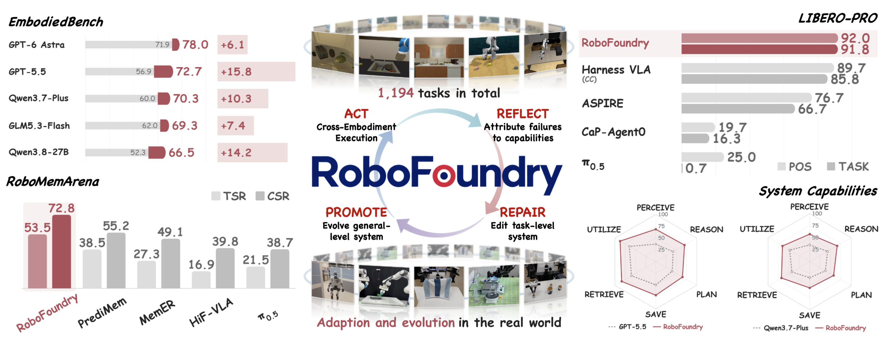

<div align="center">

# RoboFoundry

### System-as-Policy Evolution for Self-Learning Embodied Agents

[Jingsong Liang](https://jingsongliang.com/)<sup>1*</sup> ·
[Shuhao Liao](https://shuhaoliao.github.io/)<sup>1,2*</sup> ·
Shizhe Zhang<sup>1</sup> ·
Diyuan Hou<sup>2</sup> ·
[Yuxin Cai](https://yuxin916.github.io/)<sup>1</sup> ·
Xinjian Deng<sup>3</sup> ·
[Chengyang He](https://www.linkedin.com/in/chengyang-he-985807344/)<sup>3</sup> ·
[Wenhui Huang](https://oscarhuangwind.github.io/)<sup>1</sup> ·
Runjia Tan<sup>1</sup> ·
Zhidong Wang<sup>1</sup> ·
Lan Yu<sup>4</sup> ·
Xuesong Tian<sup>4</sup> ·
[Guillaume Sartoretti](https://www.marmotlab.org/)<sup>3</sup> ·
Jie Luo<sup>2</sup> ·
[Yao Mu](https://yaomarkmu.github.io/)<sup>5</sup> ·
[Wenjun Wu](http://admire.buaanlsde.cn/)<sup>2‡</sup> ·
[Wanhua Li](https://li-wanhua.github.io/)<sup>1‡</sup> ·
[Chen Lv](https://lvchen.wixsite.com/automan)<sup>1‡</sup>

<sup>1</sup>Nanyang Technological University · <sup>2</sup>Beihang University<br>
<sup>3</sup>National University of Singapore · <sup>4</sup>Cloud Butterfly Technology<br>
<sup>5</sup>Shanghai Jiao Tong University

<sup>*</sup>Equal Contribution · <sup>‡</sup>Corresponding Author

[Project Page](https://jingsongliang.com/robofoundry/) · [Overview Video](https://jingsongliang.com/robofoundry/#project-video) · [Paper](https://arxiv.org/abs/2609.32862)

Code release soon.

<br>

<!-- Overview image from https://jingsongliang.com/robofoundry/ -->


</div>

## TODO

- [ ] Release EmbodiedBench code.
- [ ] Release RoboMemArena code.
- [ ] Release LIBERO-PRO code.

## Citation

```bibtex
@misc{liang2026robofoundry,
  title={RoboFoundry: System-as-Policy Evolution for Self-Learning Embodied Agents},
  author={Jingsong Liang and Shuhao Liao and Shizhe Zhang and Diyuan Hou and Yuxin Cai and Xinjian Deng and Chengyang He and Wenhui Huang and Runjia Tan and Zhidong Wang and Lan Yu and Xuesong Tian and Guillaume Sartoretti and Jie Luo and Yao Mu and Wenjun Wu and Wanhua Li and Chen Lv},
  year={2026},
  eprint={2609.32862},
  archivePrefix={arXiv},
  primaryClass={cs.RO},
  url={https://arxiv.org/abs/2609.32862}
}
```
